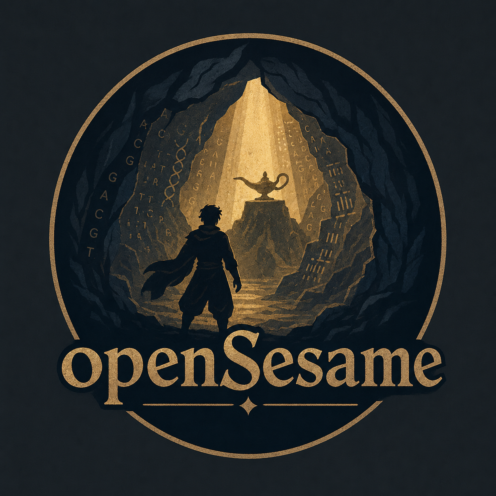

# openSesame



`openSesame` is a Nextflow DSL2 workflow for processing Illumina methylation IDAT files with [SeSAMe](https://bioconductor.org/packages/sesame/). It is designed for MethylationEPIC v2.0 (EPICv2) cohorts, from paired IDATs through quality control, probe filtering, differential methylation positions (DMPs), and optional differential methylation regions (DMRs).

## What it does

- Validates a samplesheet and paired Red/Green `.idat` or `.idat.gz` files, then writes a normalized samplesheet and input checksums.
- Preprocesses each sample with SeSAMe using the explicit `QCDPB` preparation code by default, retaining per-sample metrics and software versions.
- Builds cohort beta-value, M-value, and detection matrices, plus an analysis RDS.
- Performs sample-level QC with detection/intensity/missingness metrics, PCA, correlation, clustering, and auditable proposed exclusions.
- Filters probes by detection rate and missingness, with optional sex-chromosome, non-CpG, and user-supplied exclusion-list filtering. Every excluded probe is reported with its reason.
- Runs limma DMP analysis on filtered M-values with a full-rank model formula and one or more contrasts. Results include both a covariate-adjusted beta-model estimate and the bounded observed group-mean beta difference.
- Optionally runs EPICv2-aware DMRcate DMR analysis on hg38 using the same DMP model and contrasts.
- Produces an HTML cohort report, MultiQC custom-content input, and Nextflow run provenance (report, trace, timeline, and DAG).

## Requirements

- Nextflow `>= 26.04.4`
- One execution profile: Docker, Apptainer/Singularity, or SLURM with Apptainer
- An EPICv2-compatible container image. The supplied default is `docker.io/daleannear/opensesame:0.3.0`.

## Input samplesheet

Supply a CSV with these required columns:

| Column | Description |
| --- | --- |
| `sample_id` | Unique sample identifier. |
| `idat_red` | Absolute or workflow-visible path to the Red IDAT. |
| `idat_green` | Absolute or workflow-visible path to the Green IDAT. |

All additional columns are retained as sample metadata and can be used in `--design`, for example `group`, `age`, `sex`, and `batch`.

```csv
sample_id,idat_red,idat_green,group,sex,batch
HEK_ADNP_Y497C_1,/data/210207430010_R01C01_Red.idat.gz,/data/210207430010_R01C01_Grn.idat.gz,Y497C,female,array1
HEK_ADNP_WT_1,/data/210207430011_R01C01_Red.idat.gz,/data/210207430011_R01C01_Grn.idat.gz,WT,female,array1
```

Red files must end in `_Red.idat` (optionally `.gz`); Green files must end in `_Grn.idat` or `_Green.idat` (optionally `.gz`), and each pair must share the same basename. `--input_glob` remains available for older workflows but is deprecated in favour of a samplesheet.

## Quick start

Build and tag the supplied Dockerfile, replacing the example repository with your own if required:

```bash
docker build -t docker.io/<dockerhub-user>/opensesame:0.3.0 .
docker push docker.io/<dockerhub-user>/opensesame:0.3.0
```

Create a small override config to use that image:

```groovy
process.container = 'docker.io/<dockerhub-user>/opensesame:0.3.0'
```

Save it as `my_container.config`, then run preprocessing, QC, filtering, and reporting:

```bash
nextflow run . -profile docker -c my_container.config \
  --input /data/samplesheet.csv \
  --outdir results
```

Use `--resume` to reuse completed tasks when inputs, parameters, and implementation have not changed.

## Differential methylation (DMP)

DMP testing uses limma on M-values. The formula in `--design` must be full rank; include known batch or covariates in the model instead of batch-correcting the primary matrices.

For a two-group comparison:

```bash
nextflow run . -profile docker -c my_container.config \
  --input /data/samplesheet.csv --outdir results_dmp \
  --find_dmps true \
  --design '~ 0 + group + age + sex + batch' \
  --contrast 'groupY497C-groupWT'
```

To compare several groups against WT, pass comma-separated contrasts. With group values `Y497C`, `WT`, `siRNA`, `547X`, and `708MISS`:

```bash
--design '~ 0 + group' \
--contrast 'groupY497C-groupWT,groupsiRNA-groupWT,group547X-groupWT,group708MISS-groupWT'
```

For simple `group<case>-group<reference>` contrasts, each complete DMP table contains:

- `delta_beta_adjusted`: beta-scale coefficient from the covariate-adjusted linear model. This is unconstrained and can be outside -1 to 1.
- `delta_beta_observed`: observed mean beta of the case group minus the reference group. This is always between -1 and 1.

`--min_abs_delta_beta` filters DMPs using `delta_beta_observed`; default FDR is `0.05` and the default minimum absolute observed delta beta is `0.05`.

## Differential methylation regions (DMR)

Enable DMRs only alongside DMPs. DMRcate uses the same design and contrasts and supports EPICv2 hg38 analysis:

```bash
nextflow run . -profile docker -c my_container.config \
  --input /data/samplesheet.csv --outdir results_dmp_dmr \
  --find_dmps true --find_dmrs true \
  --design '~ 0 + group + batch' \
  --contrast 'groupY497C-groupWT'
```

DMR calls require the image to contain `DMRcate`, `DMRcatedata`, `EPICv2manifest`, and `IlluminaHumanMethylationEPICv2anno.20a1.hg38`. EPICv2 DMR analysis is hg38-only and stops rather than silently substituting EPICv1 coordinates. See [DMR details](docs/dmr.md).

## HPC execution

For an Apptainer/Singularity environment:

```bash
nextflow run . -profile apptainer -c my_container.config \
  --input /shared/project/samplesheet.csv --outdir results
```

For SLURM, combine the supplied SLURM and Apptainer profiles, adding a site-specific config for queues, account, partitions, and resource limits:

```bash
nextflow run . -profile slurm,apptainer -c site.config -c my_container.config \
  --input /shared/project/samplesheet.csv --outdir results
```

Ensure the IDAT paths, work directory, output directory, and image are visible from every compute node.

## Key parameters

| Parameter | Default | Purpose |
| --- | --- | --- |
| `--sesame_prep_code` | `QCDPB` | SeSAMe preparation sequence. Change only after validation for the installed SeSAMe version. |
| `--min_detection_rate` | `0.95` | Minimum detection-rate threshold used in QC and probe filtering. |
| `--max_missing_rate` | `0.05` | Maximum per-probe beta-value missingness. |
| `--auto_exclude_samples` | `false` | Apply QC exclusions rather than only reporting them. |
| `--find_dmps` | `false` | Run limma DMP analysis. |
| `--find_dmrs` | `false` | Run DMRcate; requires `--find_dmps true`. |
| `--fdr` | `0.05` | Benjamini–Hochberg threshold for DMPs. |
| `--min_abs_delta_beta` | `0.05` | Minimum absolute observed DMP delta beta and DMRcate regional effect. |

Nextflow JSON/YAML parameter files are supported with `-params-file`. Inspect all defaults with `nextflow config .`.

## Outputs

```text
results/
├── input_validation/                 normalized samplesheet and input checksums
├── preprocessing/                    per-sample objects, cohort matrices, analysis RDS
├── qc/                               metrics, plots, proposed/final exclusions, HTML report
├── filtering/                        retained matrices, filtering summary, excluded-probe reasons
├── differential_methylation/
│   ├── dmp/                          model, testability summary, complete/significant DMP tables
│   └── dmr/                          complete/significant TSV, BED, RDS, plots, and summary
├── report/                           cohort report and MultiQC custom-content input
└── pipeline_info/                    Nextflow report, trace, timeline, DAG, and provenance
```

See [output details](docs/output.md) for the complete layout.

## Scientific scope and limitations

- This workflow is EPICv2-oriented. It does not claim general support for mixed array cohorts.
- Cross-reactive and SNP-probe masks are not guessed or bundled; provide a validated exclusion list when needed.
- Cell-composition estimation and matrix-level batch correction are not enabled by default. Model known covariates directly.
- DMRs are supported through EPICv2-aware DMRcate on hg38; blocks are not implemented.
- IDATs are array-intensity files, not sequencing reads; FastQC is therefore not applicable.

The [feature-parity assessment](docs/feature_parity.md) records implementation status and limitations. For processing details, see [usage](docs/usage.md), [methods](docs/methods.md), [outputs](docs/output.md), and [troubleshooting](docs/troubleshooting.md).

## Validation

Run the configuration and workflow tests in an environment with Nextflow, nf-test, Docker, and the documented EPICv2 fixture:

```bash
nextflow config .
nf-test test
```
